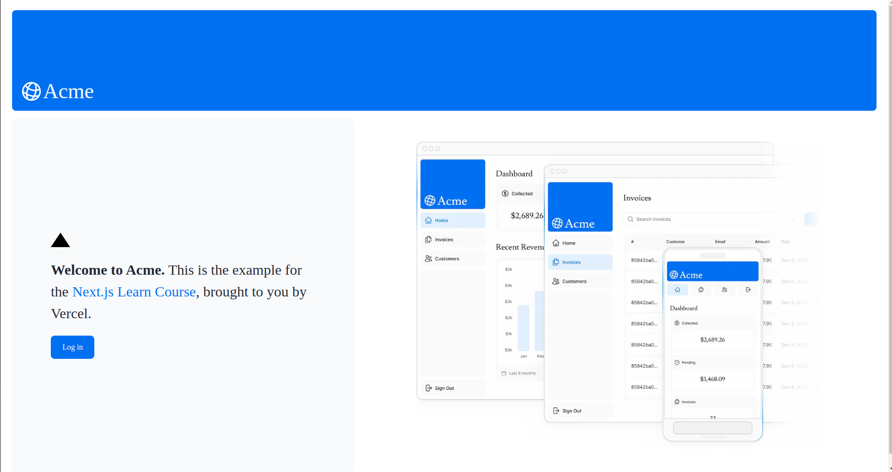
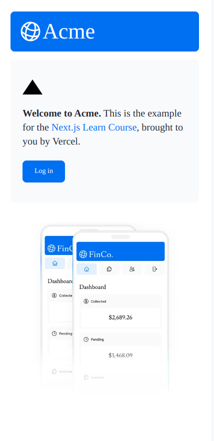
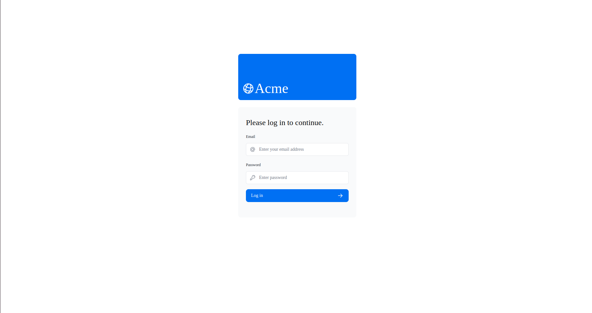
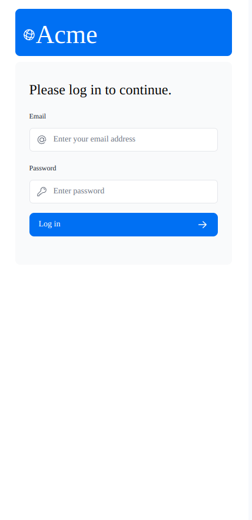
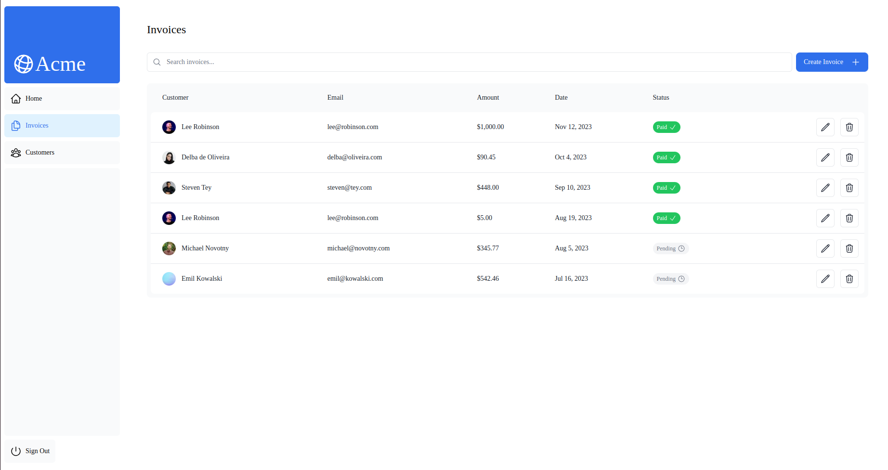
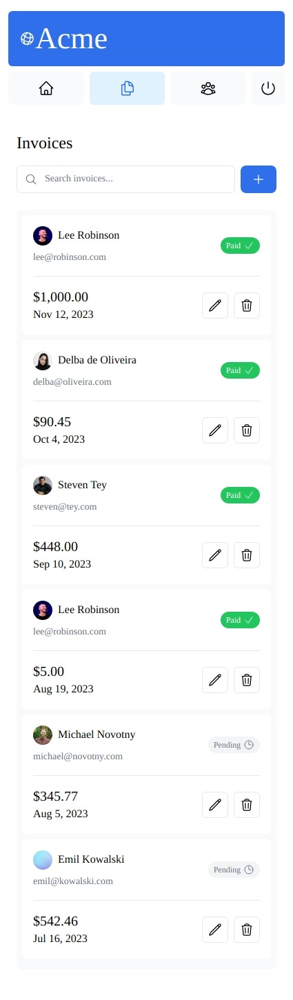
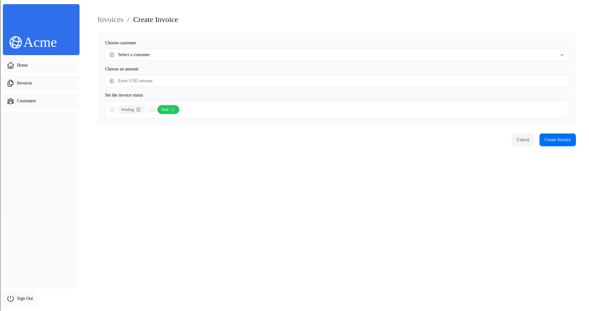
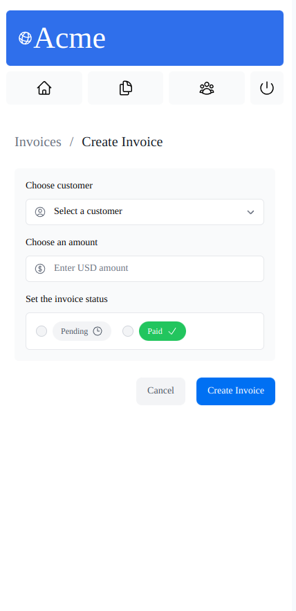
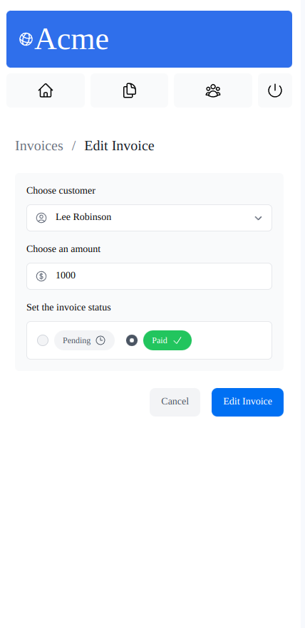

## Invoices Dashboard

I completed a Next.js app course, mastering the key features of Next.js and building a full-stack web application. This course equipped me with the skills to develop scalable and performant web solutions using Next.js.

## Overview

Here's an overview of the features I learned about in this course:

- **Styling**: The different ways to style your application in Next.js.
- **Optimizations**: How to optimize images, links, and fonts.
- **Routing**: How to create nested layouts and pages using file-system routing.
- **Data Fetching**: How to set up a database on Vercel, and best practices for fetching and streaming.
- **Search and Pagination**: How to implement search and pagination using URL Search Params.
- **Mutating Data**: How to mutate data using React Server Actions, and revalidate the Next.js cache.
- **Error Handling**: How to handle general and 404 not found errors.
- **Form Validation and Accessibility**: How to do server-side form validation and tips for improving accessibility.
- **Authentication**: How to add authentication to your application using NextAuth.js and Middleware.
- **Metadata**: How to add metadata and prepare your application for social sharing.

## Built With

This project was built using these technologies:

- NextJS 
- TailwindCSS
- Postgresql
- Vercel

## 🛠 Installation and Setup Instructions

1. Installation: `npm i`

3. In the project directory, you can run: `npm run dev`

Runs the app in the development mode.\
Open [http://localhost:3000](http://localhost:3000) to view it in the browser.
The page will reload if you make edits.

## Navigation

This dashboard include:

- A public home page.
- A login page.
- Dashboard pages that are protected by authentication.
- The ability for users to add, edit, and delete invoices.

## Demo

Check out the live demo of my portfolio at https://nextjs14-dashboard-three-nu.vercel.app/

## Screenshots

### Home page

|  |  |
| ------------------------------ | ----------------------------- |
| Desktop version                | Mobile version                |

### Login page

|  |  |
| ------------------------------ | ----------------------------- |
| Desktop version                | Mobile version                |

### Invoices page

|  |  |
| ------------------------------ | ----------------------------- |
| Desktop version                | Mobile version                |

### Create invoice page

|  |  |
| ------------------------------ | ----------------------------- |
| Desktop version                | Mobile version                |

### Update invoice page

|  |  |
| ------------------------------ | ----------------------------- |
| Desktop version                | Mobile version                |

